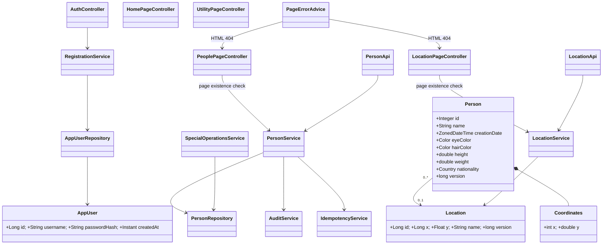
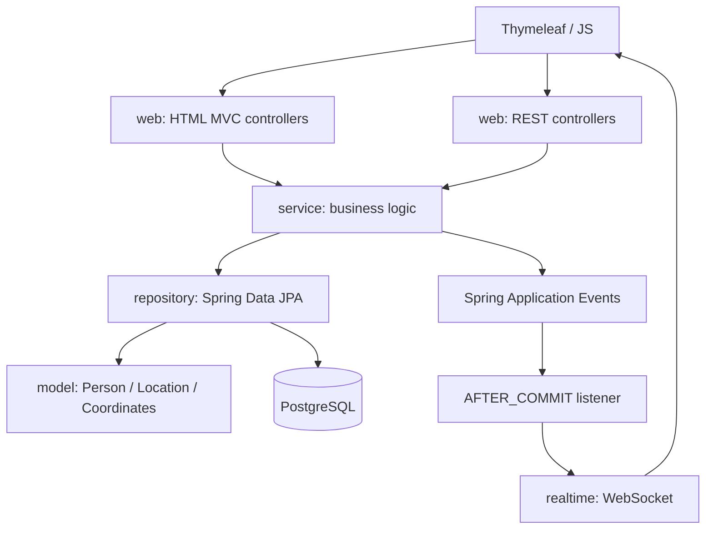

# UML (Mermaid)

## Классы / связи

```mermaid
classDiagram
  class Person {
    +Integer id
    +String name
    +ZonedDateTime creationDate
    +Color eyeColor
    +Color hairColor
    +double height
    +double weight
    +Country nationality
    +long version
  }
  class Coordinates { +int x; +double y }
  class Location { +Long id; +Long x; +Float y; +String name; +long version }
  class AppUser { +Long id; +String username; +String passwordHash; +Instant createdAt }
  class RegistrationService
  class AppUserRepository
  class AuthController
  class PeoplePageController
  class LocationPageController
  class HomePageController
  class UtilityPageController
  class PersonApi
  class LocationApi
  class PageErrorAdvice
  class PersonService
  class PersonRepository
  class AuditService
  class IdempotencyService
  class SpecialOperationsService
  class LocationService
  Person *-- Coordinates
  Person "0..*" --> "0..1" Location
  AuthController --> RegistrationService
  RegistrationService --> AppUserRepository
  AppUserRepository --> AppUser
  PeoplePageController --> PersonService : page existence check
  LocationPageController --> LocationService : page existence check
  PageErrorAdvice --> PeoplePageController : HTML 404
  PageErrorAdvice --> LocationPageController : HTML 404
  PersonApi --> PersonService
  LocationApi --> LocationService
  PersonService --> PersonRepository
  PersonService --> AuditService
  PersonService --> IdempotencyService
  SpecialOperationsService --> PersonRepository
  LocationService --> Location
```

## Пакеты

```mermaid
flowchart TD
  UI[Thymeleaf / JS] --> PAGE[web: HTML MVC controllers]
  UI --> API[web: REST controllers]
  PAGE --> SERVICE[service: business logic]
  API --> SERVICE
  SERVICE --> REPO[repository: Spring Data JPA]
  REPO --> ENTITY[model: Person / Location / Coordinates]
  REPO --> PG[(PostgreSQL)]
  SERVICE --> EVENT[Spring Application Events]
  EVENT --> AFTER[AFTER_COMMIT listener]
  AFTER --> WS[realtime: WebSocket]
  WS --> UI
```
